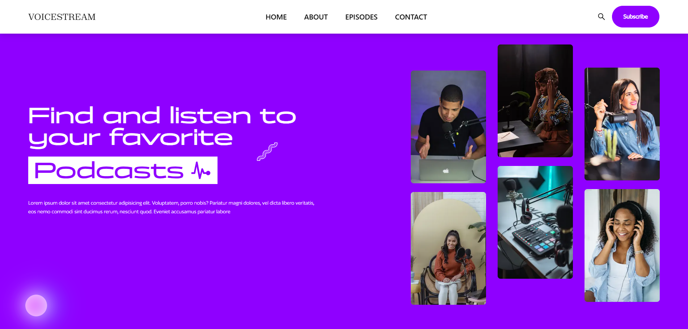

# Podcast Website with Next.js & Sanity

 

A modern podcast website built with Next.js 13, TypeScript, and Sanity CMS. This project features a responsive design, seamless content management, and optimized audio playback experience.

## 📱 Live Demo

[View Live Demo](https://podcast-web-app-woad.vercel.app/)

## Features

- **Content Management**: Easily manage podcast episodes, show notes, and metadata through Sanity Studio
- **Responsive Design**: Fully responsive layout that works on all devices
- **Type Safety**: Built with TypeScript for better developer experience
- **Next.js 13**: Utilizes the latest Next.js features including App Router
- **Audio Player**: Custom audio player with playback controls
- **SEO Optimized**: Proper metadata and structured data for podcast episodes
- **Performance**: Optimized for fast loading and smooth playback

## Technologies Used

- [Next.js 13](https://nextjs.org/) - React framework
- [TypeScript](https://www.typescriptlang.org/) - Type checking
- [Sanity CMS](https://www.sanity.io/) - Content management
- [React Icons](https://react-icons.github.io/react-icons/) - Icons

## Getting Started

### Prerequisites

- Node.js (v18 or later recommended)
- npm or yarn
- Sanity account

### Installation

1. Clone the repository:
   ```bash
   git clone https://github.com/your-username/podcast-website.git
   cd podcast-website
